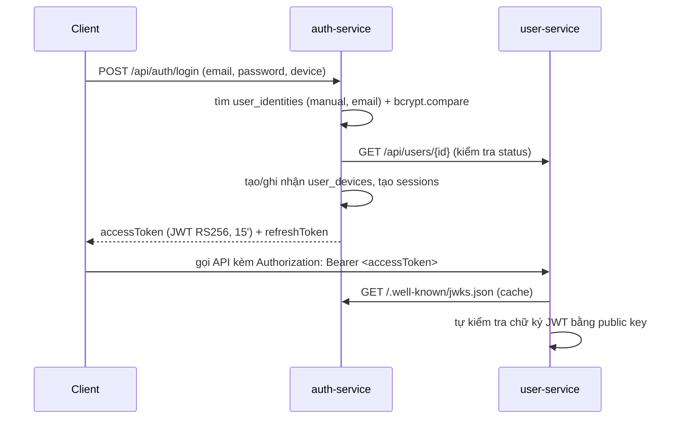

# ARCHITECTURE – auth-service

Tài liệu kiến trúc của **auth-service**. Đọc cùng [docs/ERD.md](docs/ERD.md) (dữ liệu) và Swagger tại `/docs` (API).
Quy ước code giống hệt user-service.

## 1. Vai trò trong hệ thống

| Service | Sở hữu | Không làm |
|---|---|---|
| **auth-service** (cổng 8081) | Cách đăng nhập (`user_identities`), thiết bị, session, ký JWT | Không lưu hồ sơ user, role, permission |
| **user-service** (cổng 8080) | Hồ sơ user, role, permission | Không lưu mật khẩu, không cấp token |



Access token chỉ chứa định danh: `kind` = `user`, `sub` = userId, `sid` = sessionId, `iss`, `aud`, `iat`, `exp`, `jti`.
Quyền (role/permission) **không** nằm trong token: service nhận request tự tra quyền (user-service sở hữu dữ liệu quyền).

Có hai loại token, cùng khoá ký RS256, phân biệt bằng claim `kind`:

| `kind` | `sub` | Claim riêng | Thời hạn | Dùng cho |
|---|---|---|---|---|
| `user` | userId | `sid` (session) | `ACCESS_TOKEN_TTL_SECONDS` | Người dùng gọi API |
| `service` | `auth-service` | `scope` = `user:create user:read` | 5 phút, cache, tự làm mới | auth-service gọi user-service (đăng ký, đăng nhập, seed) |

auth-service chỉ chấp nhận token `kind: "user"` ở các API của mình; user-service chỉ cho token service làm đúng các quyền trong `scope`.

## 2. Kiến trúc phân tầng (Clean Architecture)

| Tầng | Được import | Không được import |
|---|---|---|
| `domain` | chỉ `domain` | express, mongoose, mọi tầng khác |
| `application` | `domain` | `infrastructure`, `presentation`, express, mongoose |
| `infrastructure` | `domain` | `application`, `presentation`, express |
| `presentation` | `application`, `domain` | `infrastructure`, mongoose |
| `container.ts`, `main.ts`, `seed.ts`, `generate_keys.ts` | tất cả | – |

Quy tắc được **ESLint kiểm tra tự động** (`no-restricted-imports` trong `eslint.config.js`).

Những thứ bên ngoài (bcrypt, JWT, user-service) được application dùng qua **port** – interface ở `domain/ports`:

| Port | Bản cài đặt (infrastructure) | Bản giả trong test |
|---|---|---|
| `PasswordHasher` | `security/bcrypt_password_hasher.ts` (bcryptjs) | cùng class, cost 4 |
| `AccessTokenService` | `security/jose_access_token_service.ts` (jose, RS256) | cùng class, khoá sinh trong bộ nhớ |
| `UserDirectory` | `http/user_service_client.ts` (fetch, timeout 5s) | `FakeUserDirectory` (bộ nhớ) |

## 3. Code map

```
auth-service/
├─ README.md · ARCHITECTURE.md · docs/ERD.md
├─ .env / .env.example                    cấu hình (mục 6)
├─ keys/private.pem                       khoá ký JWT – sinh bằng `npm run keys:generate`, KHÔNG commit
├─ src/
│  ├─ main.ts                             entry `npm run dev/start`: nạp khoá → kết nối DB + index → HTTP
│  ├─ seed.ts                             entry `npm run seed`: tạo đăng nhập mật khẩu cho SUPER_ADMIN
│  ├─ generate_keys.ts                    entry `npm run keys:generate`: sinh khoá RSA 2048 (không ghi đè)
│  ├─ container.ts                        composition root: createRoutes() · createSeeder()
│  ├─ domain/
│  │  ├─ entities/                        1 file = 1 bảng: user_identity · user_device · session (+ isSessionActive)
│  │  ├─ repositories/                    interface lưu trữ, 1 file = 1 bảng
│  │  ├─ ports/                           password_hasher · access_token_service · user_directory
│  │  └─ errors/                          duplicate_key_error · user_service_error
│  ├─ application/
│  │  ├─ services/
│  │  │  ├─ auth_service.ts               register · login · refresh · logout · logoutAll · changePassword · authenticate
│  │  │  ├─ session_service.ts            list · revoke
│  │  │  └─ user_device_service.ts        list · update (chặn thiết bị → thu hồi session)
│  │  ├─ seeders/super_admin_seeder.ts    chỉ dùng cho `npm run seed`
│  │  ├─ validators/                      common_validator · auth_validator · user_device_validator
│  │  ├─ dtos/auth_dto.ts                 TokenPair, LoginResult, Session (dữ liệu trả ra không phải bảng)
│  │  ├─ shared/token_hash.ts             sinh token ngẫu nhiên, SHA-256, so sánh an toàn thời gian
│  │  └─ errors/app_error.ts              AppError 400/401/403/404/409
│  ├─ infrastructure/
│  │  ├─ config/env.ts
│  │  ├─ database/mongodb/                connection · mongo_errors · models/ · repositories/mongoose_<bảng>_repository.ts
│  │  ├─ security/                        jwt_signer · jose_access_token_service (token user) · service_token_provider (token service) · bcrypt_password_hasher · rsa_key_file
│  │  └─ http/user_service_client.ts      gọi user-service
│  └─ presentation/
│     ├─ app.ts                           json, /health, /docs, routes, 404, error handler
│     ├─ middlewares/                     authenticate (Bearer → kiểm tra JWT + session còn hiệu lực) · error_handler
│     ├─ controllers/ · routes/           auth · session · user_device · jwks
│     ├─ utils/request.ts                 IP/User-Agent, id param, auth context
│     └─ docs/                            openapi_helpers · openapi_spec
└─ tests/
   ├─ helpers/test_server.ts              app trên DB *_test riêng + FakeUserDirectory + khoá RSA tạm
   ├─ auth_api.test.ts                    e2e mọi luồng & trường hợp lỗi
   ├─ openapi_contract.test.ts            Swagger ↔ API thật (route, mọi status, schema response)
   └─ user_service_client.test.ts         gọi user-service: gửi token service (đúng claim, có cache), map lỗi 404/409/503
```

## 4. Các luồng chính

| Luồng | Xử lý |
|---|---|
| Đăng ký | Kiểm tra email chưa có identity → băm mật khẩu → user-service tạo user (`pending`) → tạo identity `manual` |
| Đăng nhập | Tìm identity → bcrypt (email không tồn tại vẫn chạy bcrypt giả để không lộ email qua thời gian phản hồi) → kiểm tra status user (`active`/`pending`) → thiết bị (dùng lại nếu `device.id` của chính user, chặn nếu `isActive = false`) → thu hồi session cũ của thiết bị → tạo session → cấp token |
| Refresh | Tách `sessionId.secret` → session phải còn hiệu lực → hash khớp (không khớp = dùng lại → thu hồi) → thiết bị & user còn hợp lệ → xoay refresh token |
| Gọi API cần đăng nhập | Middleware `authenticate`: kiểm tra chữ ký/iss/aud/exp **và** session chưa bị thu hồi → logout có hiệu lực ngay trong auth-service |
| Đổi mật khẩu | Kiểm tra mật khẩu hiện tại → băm mới → thu hồi mọi session khác |
| Xác minh email | Đăng ký → token 32 byte (lưu SHA-256) → notification-service gửi `email-verification` với `VERIFY_EMAIL_URL?token=…` → frontend gọi `POST /api/auth/verify-email` → user-service `POST /users/{id}/verify-email` (pending → active) → đánh dấu token đã dùng → gửi `welcome` |
| Gửi lại email | `POST /api/auth/verify-email/resend` luôn 202 (không lộ email); chạy nền; mỗi email tối đa 1 lần / phút; link cũ hết hiệu lực |
| Ghi nhận đăng nhập | Sau khi login thành công → user-service `POST /users/{id}/logins` (`lastLoginAt`, `lastLoginProvider`); lỗi chỉ ghi log, không chặn đăng nhập |

### 4.2 Bảo vệ chống lạm dụng

| Endpoint | Giới hạn (theo IP, in-memory) |
|---|---|
| `POST /api/auth/login` | 5 lần **sai** / 15 phút cho mỗi IP + email (đăng nhập đúng không tính) |
| `POST /api/auth/register` | 10 / giờ |
| `POST /api/auth/refresh`, `/verify-email` | 100 / 15 phút (chung) |
| `POST /api/auth/verify-email/resend` | 5 / 15 phút |
| `POST /oauth/token` | 10 lần **sai** / 15 phút cho mỗi IP + client_id |

Vượt giới hạn → 429 kèm header `RateLimit-Policy`, `RateLimit`, `Retry-After`. Bộ đếm nằm trong bộ nhớ từng instance –
chạy nhiều instance thì chuyển sang Redis store. Sau reverse proxy phải đặt `TRUST_PROXY` để lấy đúng IP.

Mọi service đều bật `helmet` (header bảo mật, ẩn `X-Powered-By`) và CORS chỉ cho các origin trong `CORS_ORIGINS`.

Service khác (user-service) chỉ kiểm tra JWT bằng JWKS, không hỏi auth-service ở mỗi request ⇒ sau logout,
access token còn dùng được ở service khác tối đa `ACCESS_TOKEN_TTL_SECONDS` (15 phút). Đây là đánh đổi chuẩn của JWT.

### 4.1 OAuth client credentials (server-to-server)

```
admin (oauth-client:create) ── POST /api/oauth-clients ──▶ { clientId, clientSecret (1 lần) }
service ── POST /oauth/token (client_credentials) ──▶ JWT kind=service, sub=clientId, scope, 10'
service ── Authorization: Bearer ──▶ user-service / service khác (kiểm tra scope)
```

- Tạo client cho service nội bộ lúc setup: `npm run oauth-client:create -- <name> <scope...>`
  (chủ = `SUPER_ADMIN_EMAIL`), ví dụ `npm run oauth-client:create -- notification-service user:read`.
- `/oauth/token` theo RFC 6749 §4.4: body form-urlencoded hoặc JSON, hoặc `Authorization: Basic`;
  lỗi dạng `{ error, error_description }`; luôn `Cache-Control: no-store`.
- API quản trị `/api/oauth-clients` cần permission `oauth-client:*`. auth-service hỏi quyền của user qua
  `GET /api/users/{id}/effective-permissions` (token service, scope `user:read`).

### Audit

Mỗi thay đổi thành công (2xx) trên các route khai báo `audit("<resource>")` được gửi sang **audit-service** (chạy nền,
thử lại 1s/5s/15s; field chứa password/secret/token/hash bị ẩn). `oldValue` đọc trước khi sửa/xoá, `newValue` = response.
Để trống `AUDIT_SERVICE_URL` = tắt audit.

| Resource | Route |
|---|---|
| `auth-register` · `auth-verify-email` | userId null (route công khai), newValue = user |
| `auth-login` | userId null, resourceId = user, **không lưu body** (token) |
| `auth-logout` · `auth-logout-all` · `auth-password` | userId = người dùng, không lưu body |
| `session` · `device` · `oauth-client` | thu hồi session, sửa thiết bị, quản lý OAuth client (secret bị ẩn) |
| _không ghi_ | refresh, gửi lại email, `/oauth/token`, mọi request lỗi |

## 5. Lỗi & HTTP status

| Nguồn | Status |
|---|---|
| Validator | 400 |
| Sai email/mật khẩu, token sai/hết hạn, session bị thu hồi | 401 (kèm `WWW-Authenticate: Bearer`) |
| User `inactive`/`blocked`/`banned`, thiết bị bị chặn | 403 |
| Không tìm thấy session/thiết bị (hoặc của user khác) | 404 |
| Email đã tồn tại | 409 |
| JSON lỗi · body quá 100KB · charset lạ | 400 · 413 · 415 |
| user-service không phản hồi / lỗi | 503 |

## 6. Cấu hình

| Biến | Mặc định | Mô tả |
|---|---|---|
| `PORT` | `8081` | |
| `MONGODB_URI` | – (bắt buộc) | |
| `MONGODB_DB_NAME` | `auth_service` | |
| `DNS_SERVERS` | – | DNS cho `mongodb+srv://` |
| `USER_SERVICE_URL` | `http://localhost:8080` | Gọi bằng token service (mục 1) |
| `JWT_PRIVATE_KEY_PATH` | `keys/private.pem` | Khoá RSA ký JWT |
| `JWT_ISSUER` / `JWT_AUDIENCE` | `auth-service` / `ms-api` | Service kiểm tra token phải dùng cùng giá trị |
| `ACCESS_TOKEN_TTL_SECONDS` | `900` | |
| `CLIENT_TOKEN_TTL_SECONDS` | `600` | Token cấp cho OAuth client |
| `REFRESH_TOKEN_TTL_DAYS` | `30` | |
| `BCRYPT_ROUNDS` | `12` | |
| `NOTIFICATION_SERVICE_URL` | `http://localhost:8082` | Gửi email (token service, scope `email:send`) |
| `VERIFY_EMAIL_URL` | `http://localhost:3000/verify-email` | Trang frontend nhận `?token=` |
| `EMAIL_VERIFICATION_TTL_HOURS` | `24` | |
| `CORS_ORIGINS` | trống | Origin trình duyệt được gọi API (phân cách dấu phẩy) |
| `TRUST_PROXY` | `false` | `true`, số proxy hoặc subnet khi chạy sau load balancer |
| `RATE_LIMIT_ENABLED` | `true` | Chỉ tắt trong test |
| `AUDIT_SERVICE_URL` | trống | Trống = tắt audit (dùng token service tự ký, scope `audit-log:write`) |
| `SUPER_ADMIN_EMAIL` / `SUPER_ADMIN_PASSWORD` | – | Chỉ dùng cho `npm run seed` |

## 7. Giới hạn hiện tại & hướng phát triển

- Chỉ đăng nhập email/mật khẩu; `phone_otp`, Google, Facebook, Apple: schema đã sẵn, làm đợt sau.
- Chưa có quên mật khẩu. Rate limit lưu trong bộ nhớ (cần Redis khi chạy nhiều instance).
- Chưa có đồng bộ khi user bị xoá ở user-service (bước 4 – API nội bộ hoặc event).
- Một khoá ký duy nhất; xoay khoá cần hỗ trợ nhiều khoá trong JWKS.
- Sau reverse proxy cần bật `trust proxy` để lấy đúng IP client.
