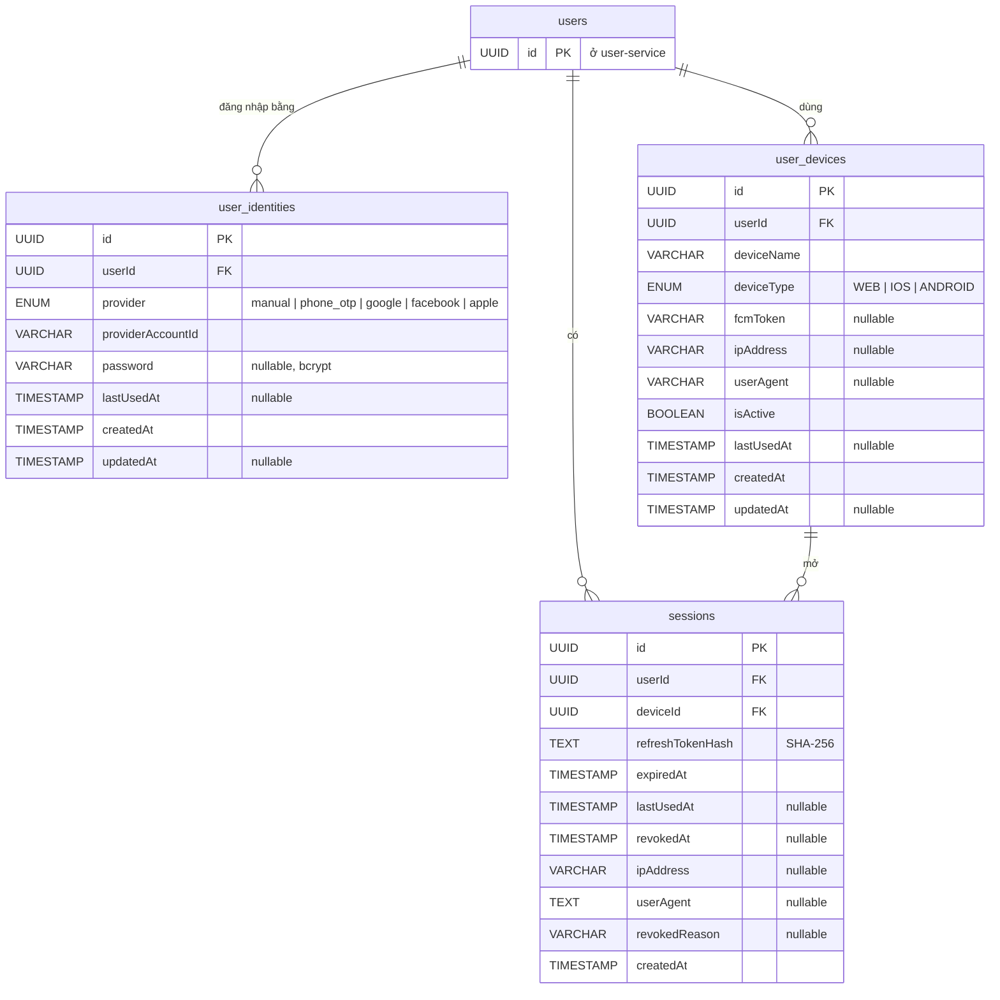

# ERD – auth-service

Lược đồ dữ liệu của **auth-service** (bounded context xác thực: cách đăng nhập, thiết bị, phiên).
Lưu trữ: MongoDB (Atlas), database `auth_service`, tách riêng với `user_service`. Mỗi bảng là một collection.

## 1. Quy ước chung

| Quy ước | Chi tiết |
|---|---|
| Khoá chính | `id` – UUID v4 chữ thường, lưu ở `_id`, sinh bằng thư viện `uuid` |
| Tên cột | `camelCase` (giống JSON trả ra API) |
| Tên collection | `snake_case`, số nhiều |
| Thời gian | `TIMESTAMP` = Mongo `Date`, luôn UTC; API trả ISO 8601 |
| `createdAt` / `updatedAt` | `createdAt` ghi khi tạo; `updatedAt` chỉ ghi khi sửa (null nếu chưa sửa) |
| `userId` | Tham chiếu `users.id` ở **user-service** (database khác) → không phải FK thật; toàn vẹn do code đảm bảo |
| Bí mật | Không lưu bản rõ: mật khẩu băm **bcrypt**, refresh token băm **SHA-256** |

## 2. Sơ đồ

## 3. Chi tiết từng bảng

### 3.1 `user_identities`

Mỗi dòng là **một cách đăng nhập** mà user đã liên kết. Nhờ vậy "đăng nhập bằng Google" và "đăng nhập bằng
email/mật khẩu" là **cùng một user**, không phải hai tài khoản.

| Cột | Kiểu | Mô tả |
|---|---|---|
| `id` | UUID | PK |
| `userId` | UUID | → `users.id` (user-service) |
| `provider` | ENUM | `manual`, `phone_otp`, `google`, `facebook`, `apple` |
| `providerAccountId` | VARCHAR(255) | email (`manual`), số điện thoại (`phone_otp`), hoặc `sub`/user id của nhà cung cấp |
| `password` | VARCHAR(255) | Chỉ có với `manual`/`phone_otp`; **bcrypt** |
| `lastUsedAt` | TIMESTAMP | Lần cuối đăng nhập bằng cách này |
| `createdAt` / `updatedAt` | TIMESTAMP | `updatedAt` ghi khi đổi mật khẩu |

Index: `(provider, providerAccountId)` **unique** – một tài khoản Google/email chỉ gắn với đúng một user · `(userId, provider)`.

Mật khẩu: bcrypt (`BCRYPT_ROUNDS`, mặc định 12), tối thiểu 8 ký tự, tối đa 72 byte (giới hạn của bcrypt).
Không có cơ chế mật khẩu cũ (SHA-256) vì hệ thống mới, không có dữ liệu cần chuyển đổi.

Đợt hiện tại chỉ dùng `manual`. Schema đã sẵn cho `phone_otp`, `google`, `facebook`, `apple`.

### 3.2 `user_devices`

| Cột | Kiểu | Mô tả |
|---|---|---|
| `id` | UUID | PK. Trả về client ở lần đăng nhập đầu (`deviceId`); client gửi lại trong `device.id` |
| `userId` | UUID | → `users.id` |
| `deviceName` | VARCHAR(255) | Tên thiết bị (client đặt) |
| `deviceType` | ENUM | `WEB`, `IOS`, `ANDROID` |
| `fcmToken` | VARCHAR(500) | Token push notification (nullable) |
| `ipAddress` | VARCHAR(50) | IP lần dùng gần nhất |
| `userAgent` | VARCHAR(500) | Trình duyệt / thiết bị |
| `isActive` | BOOLEAN | `false` → thiết bị bị chặn: không đăng nhập / refresh được, mọi session của nó bị thu hồi |
| `lastUsedAt` | TIMESTAMP | Lần đăng nhập gần nhất |
| `createdAt` / `updatedAt` | TIMESTAMP | |

Index: `(userId, lastUsedAt desc)`.

### 3.3 `sessions`

Mỗi lần đăng nhập tạo một session (quản lý refresh token).

| Cột | Kiểu | Mô tả |
|---|---|---|
| `id` | UUID | PK; cũng là claim `sid` trong access token |
| `userId` | UUID | → `users.id` |
| `deviceId` | UUID | → `user_devices.id` |
| `refreshTokenHash` | TEXT | SHA-256 của phần bí mật trong refresh token |
| `expiredAt` | TIMESTAMP | `createdAt + REFRESH_TOKEN_TTL_DAYS` (cố định, refresh không kéo dài) |
| `lastUsedAt` | TIMESTAMP | Lần refresh gần nhất |
| `revokedAt` | TIMESTAMP | Thời điểm thu hồi (null = còn hiệu lực) |
| `ipAddress` | VARCHAR(50) | IP lúc đăng nhập |
| `userAgent` | TEXT | Trình duyệt / thiết bị lúc đăng nhập |
| `revokedReason` | VARCHAR(100) | Lý do thu hồi (bảng dưới) |
| `createdAt` | TIMESTAMP | |

Index: `(userId, revokedAt, expiredAt)` · `(deviceId, revokedAt)`.

Session **đang hoạt động** = `revokedAt = null` và `expiredAt > now`. Session không bao giờ bị xoá (giữ lịch sử).

| `revokedReason` | Khi nào |
|---|---|
| `logout` | `POST /logout` |
| `logout_all` | `POST /logout-all` |
| `revoked_by_user` | `DELETE /sessions/{id}` (đăng xuất từ xa) |
| `replaced` | Đăng nhập lại trên cùng thiết bị → session cũ của thiết bị bị thay |
| `password_changed` | Đổi mật khẩu → mọi session khác bị thu hồi |
| `device_disabled` | Thiết bị bị chặn (`isActive = false`) |
| `account_disabled` | Lúc refresh, user không còn `active`/`pending` |
| `refresh_token_reused` | Một refresh token đã dùng bị gửi lại (nghi bị đánh cắp) |

### 3.4 `oauth_clients`

Credential **server-to-server** (OAuth2 client credentials). Không phải đăng nhập Google/Facebook/Apple
(những cái đó đi qua `user_identities`).

| Cột | Kiểu | Mô tả |
|---|---|---|
| `id` | UUID | PK |
| `ownerUserId` | UUID | → `users.id` – user tạo client |
| `name` | VARCHAR(255) | |
| `clientId` | VARCHAR(64) | Unique, công khai, dạng `cli_…` |
| `clientSecretHash` | VARCHAR(255) | SHA-256 của secret. Secret gốc chỉ trả **đúng 1 lần** (lúc tạo / đổi secret) |
| `status` | VARCHAR(20) | `active`, `inactive` (tạm khoá), `revoked` (vĩnh viễn, không mở lại được) |
| `scopes` | ARRAY | Permission code client được xin, ví dụ `user:read` (ít nhất 1) |
| `createdAt` / `updatedAt` / `deletedAt` | TIMESTAMP | Soft delete (xoá = đồng thời `revoked`) |

Index: `clientId` unique · `(ownerUserId, deletedAt)` · `(deletedAt, createdAt)`.

Quy tắc chống leo thang quyền:
- Tạo / sửa: chỉ gán được scope mà **người gọi đang có**.
- Mỗi lần cấp token: scope thực tế = `scopes` của client **∩ quyền hiện tại của chủ client**.
  Chủ bị gỡ quyền → client mất quyền đó ngay; chủ bị chặn / xoá → `invalid_client`.

### 3.5 `email_verification_tokens`

Token xác minh email, dùng một lần. Không có API CRUD riêng – chỉ dùng trong luồng đăng ký / `verify-email`.

| Cột | Kiểu | Mô tả |
|---|---|---|
| `id` | UUID | PK |
| `userId` | UUID | → `users.id` |
| `tokenHash` | VARCHAR(255) | Unique – SHA-256 của token gốc; token gốc chỉ nằm trong email |
| `expiresAt` | TIMESTAMP | `createdAt + EMAIL_VERIFICATION_TTL_HOURS` (mặc định 24h) |
| `consumedAt` | TIMESTAMP | Nullable – ghi khi xác minh thành công **hoặc** khi bị thay bởi link mới (gửi lại). Không xoá cứng |
| `createdAt` / `updatedAt` | TIMESTAMP | |

Index: `tokenHash` unique · `(userId, createdAt desc)`.

Email được xác minh là `providerAccountId` của identity `manual`; user-service chỉ chấp nhận nếu trùng email hiện tại
(đổi email sau khi gửi link → 409). Token chỉ bị đánh dấu dùng **sau khi** user-service xác nhận → user-service lỗi tạm thời
không làm mất token.

## 4. Refresh token

- Dạng `<sessionId>.<secret>`; `secret` = 32 byte ngẫu nhiên (base64url). DB chỉ lưu `SHA-256(secret)`.
- **Dùng một lần (rotation):** mỗi lần refresh sinh `secret` mới, cập nhật hash bằng phép so-và-ghi nguyên tử
  (`refreshTokenHash` cũ phải khớp) → hai request refresh đồng thời chỉ một cái thành công.
- **Phát hiện dùng lại:** `sessionId` đúng nhưng hash không khớp ⇒ token cũ bị dùng lại ⇒ thu hồi session
  (`refresh_token_reused`); cả kẻ gian lẫn chủ tài khoản đều phải đăng nhập lại.

## 5. Toàn vẹn với user-service

| Sự kiện | Hiện tại | Hướng xử lý |
|---|---|---|
| Đăng ký | auth-service gọi `POST /api/users` rồi tạo `user_identities` | – |
| User bị chặn / xoá ở user-service | Đăng nhập & refresh kiểm tra trạng thái user → 403 / thu hồi session | Access token đã cấp còn hiệu lực tối đa 15 phút |
| User bị xoá ở user-service | `user_identities`, `user_devices`, `sessions` còn lại | Bước 4: user-service báo auth-service (API nội bộ / event) để thu hồi session và xoá identity |
